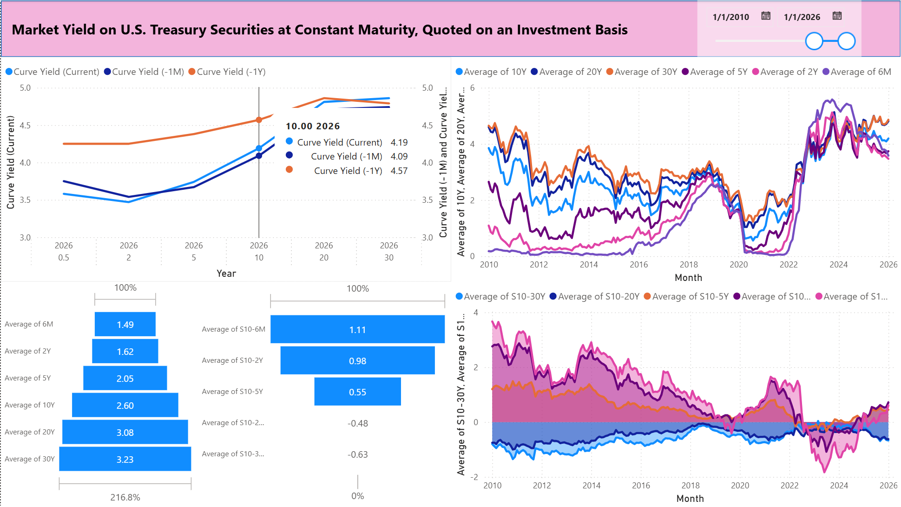

# 📈 FRED Yield Curve Analytics

Dynamic yield curve analytics terminal built in Power BI Dashboard using Federal Reserve Economic Data (FRED API).

This dashboard reconstructs the full U.S. Treasury yield curve and term spreads from 1962–[present](https://fred.stlouisfed.org/series/DGS10).

---

## 📌 Preview

---

## 🚀 Features

### Dynamic Yield Curve Engine
- Reconstructs the U.S. Treasury yield curve:
  - 6M, 2Y, 5Y, 10Y, 20Y, 30Y  
- Interactive historical curve replay

### Term Structure & Inversion Diagnostics
- Auto-computed spreads:
  - S10-6M, S10-2Y, S10-5Y, S10-20Y, S10-30Y  
- Visual inversion monitoring

### Long-Run Yield History
- Continuous yield series from 1962–present  
- Macro monetary regime overlays

### Global Navigation Engine
- Unified Calendar × Tenor dimensional model  
- One year slider controls all visuals simultaneously

---

## 📂 Data Source

Federal Reserve Economic Data (FRED)

| Series |
|------|
| DGS6MO |
| DGS2 |
| DGS5 |
| DGS10 |
| DGS20 |
| DGS30 |

---

## 🛠 Technologies

- Power BI  
- Power Query (M)  
- DAX  
- FRED API  

---

## 🧠 Dashboard Architecture & Analytical Logic

The dashboard is organized as a **four-panel macro yield intelligence system**, designed to reconstruct the full term structure of U.S. Treasury rates and its historical dynamics from the Federal Reserve Economic Data (FRED) API.

---

### 🔹 Top-Left — Yield Curve (Cross-Sectional Term Structure)

Displays the **current U.S. Treasury yield curve by maturity** and overlays:

- Current month  
- One-month lag  
- One-year lag  

Across:

> 6M · 2Y · 5Y · 10Y · 20Y · 30Y

**How it is built:**  
Power Query pulls each maturity independently from FRED, normalizes them into a unified monthly matrix, and pivots the term structure.  
DAX dynamically extracts Current, −1M, and −1Y snapshots.

**Why:**  
Creates a true macro yield surface to visualize steepening and flattening.

---

### 🔹 Top-Right — Long-Run Yield History

Displays the **historical evolution of every maturity since 1962**.

**Why:**  
Reveals secular monetary regimes, disinflation cycles, and tightening episodes.

---

### 🔹 Bottom-Right — Term Spread History

Tracks all macro spreads:

> S10-6M · S10-2Y · S10-5Y · S10-20Y · S10-30Y

**Why:**  
Yield inversions are among the strongest recession predictors — this panel serves as a stress monitor.

---

### 🔹 Bottom-Left — Current Yield & Spread Snapshot

Displays current-month yield and spread levels for instant regime assessment.

---

### 🧬 Unified Macro Engine

All visuals are driven by a **single Calendar × Tenor dimensional model**:

- One slider controls all panels  
- Guarantees mathematical consistency  
- Enables historical replay of the full U.S. yield surface

---
